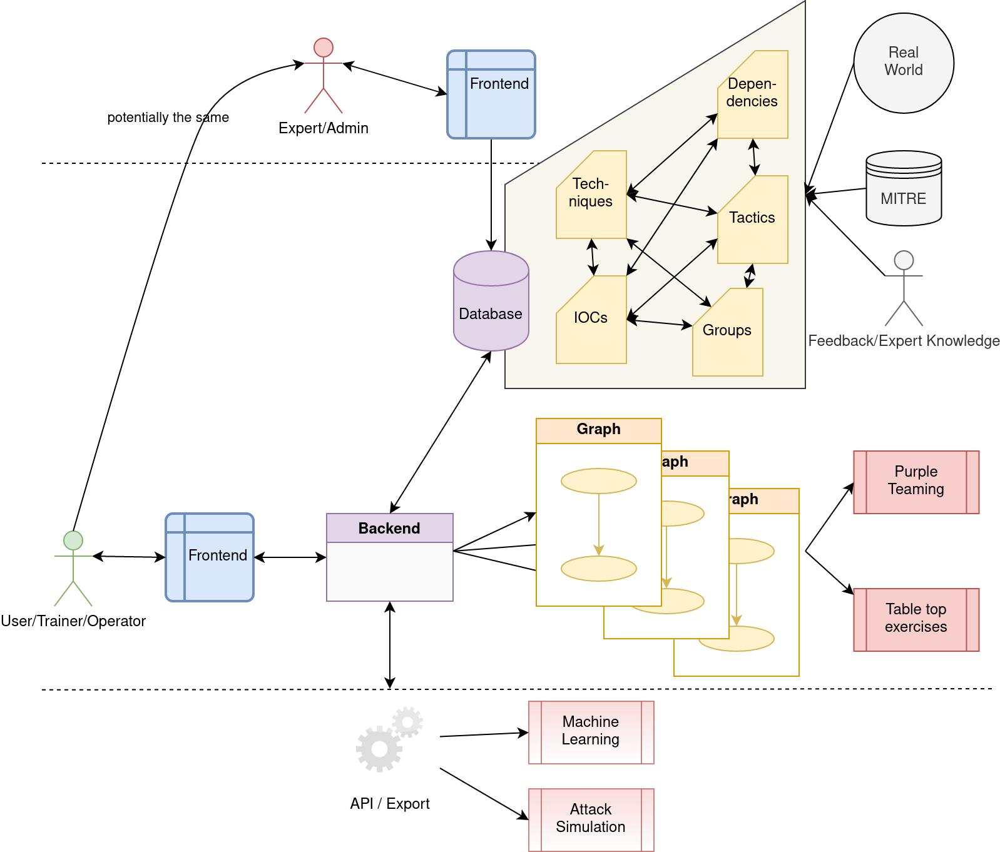

# Simulation and Purple Teaming in Industrial Control System (ICS) Environments
## Master Thesis - Jan Hoff

This work shows the viability of automatically generated attack graphs that are used for adversary behavior execution in industrial control system environments. This viability is evaluated and confirmed with expert interviews about results of this thesis, generated attack graphs and an implemented prototype.

Since existing graph-based approaches do not fulfil requirements that are set by adversary emulation or simulation activities like Purple Teaming, a new concept for attack graphs and a corresponding prototype had to be developed.

For this development theoretical foundations were used to identify requirements and use cases. The theoretical background contains information on cyberattacks, adversary emulation and simulation (e.g. Purple Teaming) as well as attack graphs. Another background section covers standard architectures and information security aspects of industrial control system environments.

Additionally to research done in this work, experts interviews allowed to derive additional room for research and additional use cases for the realized prototype. Attack graphs have shown to be a versatile means to structure risk analysis and support adversary behavior execution activities.

